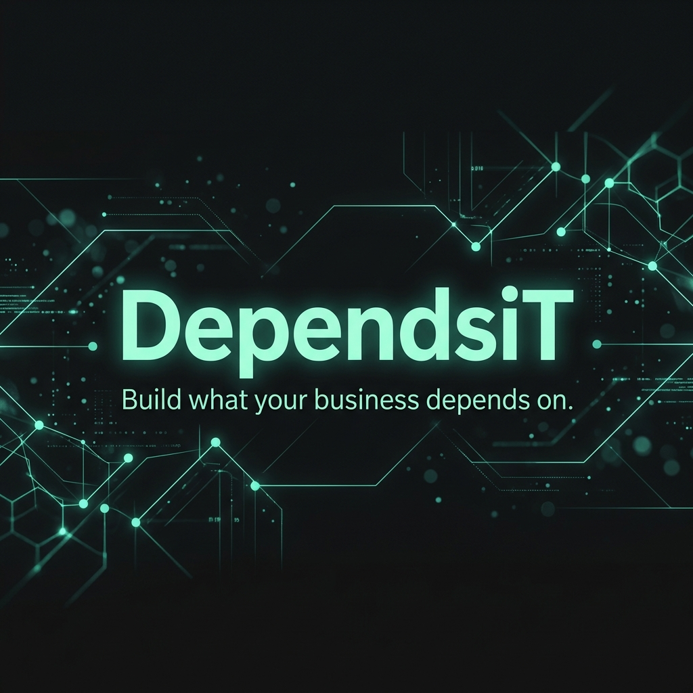

# 🚀 Welcome to DependsiT

  

  <strong>Build what your business depends on.</strong>

  
  
  

---

### 🌟 About DependsiT
**DependsiT** is a B2B technology partner building AI, automation, software, and web systems that connect and last, from the first plan to daily operation. We design and run the systems that keep businesses moving forward.

---

### 🛠️ Capabilities & Services
We act as a single accountable partner across twelve connected capabilities:

* **🤖 AI and Automation:** Save time, cut costs, and automate work with AI.
* **💻 Website Development:** Websites built for marketing, sales, and growth.
* **⚙️ Software Development:** Custom software tailored to your operations.
* **📱 Mobile App Development:** Cross-platform and native mobile apps.
* **🔌 Plugin & Extension Development:** Custom plugins, add-ons, and browser extensions.
* **📈 Digital Growth:** Grow through search, content, and campaigns.
* **🛒 eCommerce Solutions:** Sell online with scalable commerce platforms.
* **🔗 API and System Integration:** Connect your tools, platforms, and services.
* **☁️ Cloud, DevOps, & Infrastructure:** Secure, scalable infrastructure for modern business.
* **📊 Data and Business Operations:** Organize, migrate, and automate your data.
* **🧭 Consulting and Strategy:** Technology strategy, audits, and roadmaps.
* **🛠️ Support and Maintenance:** Long-term support that keeps everything running.

---

### 🤝 How We Work: Map, Build, Run
1. **Map 🧭:** We learn your problem, your systems, and the outcome you need, then map the fix.
2. **Build ⚙️:** We design and build the solution, tested, secure, and ready to depend on.
3. **Run 🚀:** We launch, support, and improve it over time so it keeps delivering.

---

### 📬 Get in Touch
* 🌐 Website: [dependsit.com](https://dependsit.com)
* 📧 Email: [contact@dependsit.com](mailto:contact@dependsit.com)
* 💬 WhatsApp / Telegram: Available on our website

---

  One partner, from the first map to the day-to-day.

